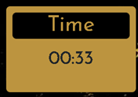
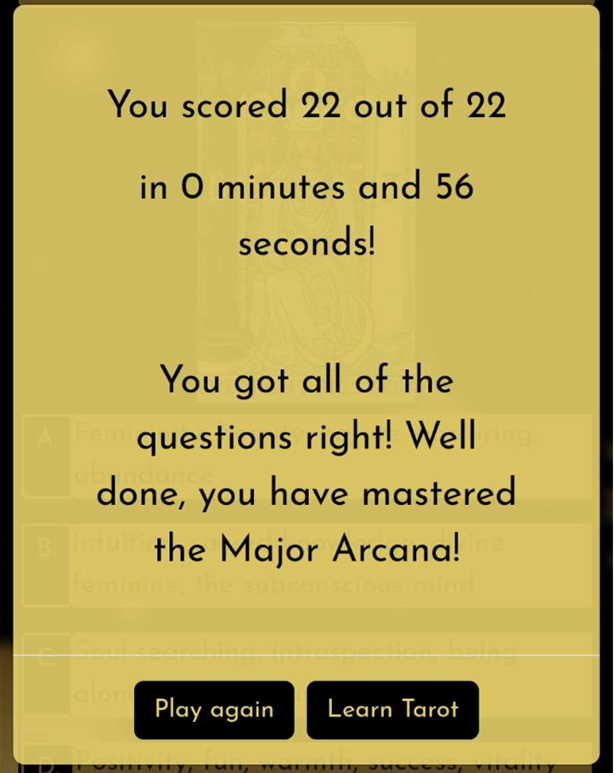
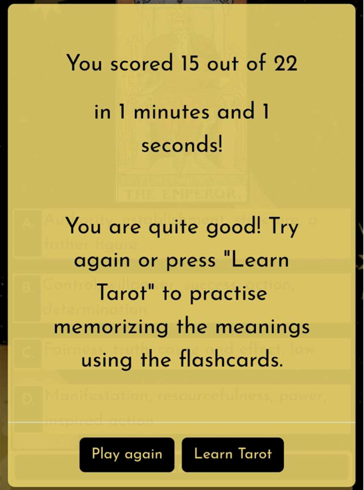
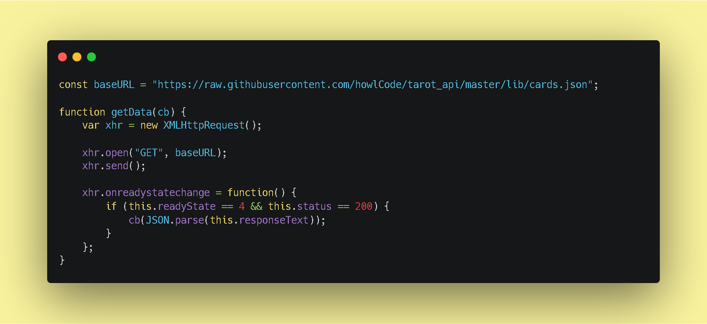
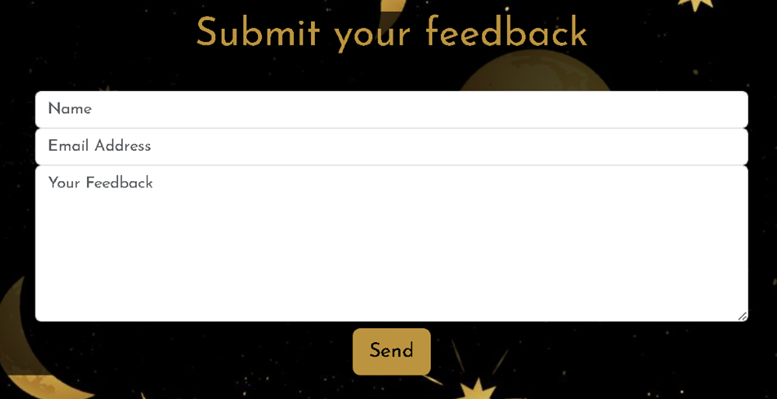
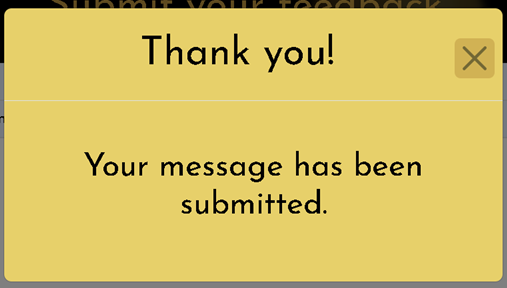

# LEARN TAROT

(Developer: Martyna Nowak)

[Live Webpage](https://mmnowak.github.io/tarot-quiz/index.html)

## Table of Contents

1. [Project Goals](#project-goals)
    1. [Overview](#overview)
    2. [Goals](#goals)
2. [User Experience](#user-experience)
    1. [Target Audience](#target-audience)
    1. [User Requirements and Expectations](#user-requirements-and-expectations)
    2. [User Stories](#user-stories)
3. [Design](#design)
    1. [Colour scheme](#colour-scheme)
    2. [Typography](#typography)
    3. [Imagery](#imagery)
    4. [Wireframes](#wireframes)
4. [Features](#features)
5. [Technologies Used](#technologies-used)
    1. [Languages](#languages)
    2. [Frameworks and Tools](#frameworks-and-tools)
6. [Testing and bugs](#testing-and-bugs)
7. [Credits](#credits)
    1. [Media](#media)
    2. [Code used](#code-used)
    3. [Content](#content)
8. [Deployment](#deployment)
10. [Acknowledgements](#acknowledgements)

## Project Goals

### Overview

The main purpose of this project is to create a user-friendly website dedicated to helping the user memorise the meanings of tarot cards. It features a multiple-choice quiz, a page containing flashcards, and a contact page allowing the user to submit their feedback. 

### Goals

1. A website that can be navigated easily and intuitively.
2. A clean design that catches the eye.
3. A website that looks good and responds correctly on all device sizes.
4. A website that is accessible to all users.
5. A quiz game that displays all questions and answer correctly.
6. Interactivity - including a timer, a progress bar and a score display.
7. Easy access for the user to contact the site owner.

## User Experience

### Target Audience

* People interested in learning more about Tarot;
* Tarot begginers and intermediate users;
* People interested in spirituality and psychology;
* Visual learners;

### User Requirements and Expectations

* Links and buttons that work as expected.
* A simple and intuitive navigation system.
* Interactive feedback and notifications.
* Information presented in clear and concise manner.
* Visually appealing design.
* Easy way to submit questions and feedback.
* Accessibility.

### User Stories

#### First Time visitor
1.	As a first-time user, I want to know the purpose of the site immediately.
2.	As a first-time user, I want to easily find out how to play the game.
3.	As a first-time user, I want to know how far along I am in the quiz game.
4.	As a first-time user, I want to know whether the answer I selected was right or wrong.
5.	As a first-time user, I want to know my final score.
6.	As a first-time user, I want to receive feedback about my performance.
7.	As a first-time user, I want to find out how to use the flashcards page.

#### Returning visitor
8.	As a returning user, I want the feedback at the end of the game to reflect my performance.
9.	As a returning user, I want to be able to contact the page owners with any feedback I might have.
10.	As a returning user, I want to find out the full meaning of each card.
11.	As a returning user, I want to be able to navigate the website easily.
12. As the returning user, I want to be able to view the site on a range of device sizes.
13. As a returning user, I want to be able to easily find my way back if I encounter an error page.

## Design

### Colour scheme

The colours were taken from the [background image](#imagery) using a colour picker tool.

WebAIM Contrast Checker was used to ensure the site is accessible. Both [#BC943F](https://webaim.org/resources/contrastchecker/?fcolor=BC943F&bcolor=000000) and [#E7D06A](https://webaim.org/resources/contrastchecker/?fcolor=E7D06A&bcolor=000000) have passed the test. 

### Typography

The font used throughout the website is [Josefin Sans](https://fonts.google.com/specimen/Josefin+Sans). The font was selected as it looks whimsical while still being easy to read. A sans serif font was specifically chosen as it is dyslexia-friendly.

### Imagery

The background image remains the same throughout the website. It is a vector image of moon and stars. The image is intended to be associated with magic, mysticism and whimsy.

Following feedback received on the peer-review Code Institute Slack channel, a blur effect was added to the background image to stop it from distracting from the foreground content.

### Wireframes

The wireframes were created using the Balsamiq software for large/medium and small screens. 

Index Page

Game Page

Learn Tarot Page

Contact Page

## Features

### All Pages

#### Navigation Bar

* Featured on all pages;
* Fully responsive, collapses into a toggler burger menu on small devices;
* Features a logo which leads to index page when clicked, and links to Index Page, Game Page, Learn Page and Contact Page;
* The links are underscored on hover;
* User stories covered: 11, 12.

#### Footer

* Featured on all pages;
* Contains credits to the page developer and relevant social links;
* The social links icons have aria labels to make them accessible to screen readers.
* User stories covered: 9.

#### Favicon

* The favicon was generated based on the background image;
* Displays in the user's browser tab for all the pages.

### Index Page

#### Index Text

* Contains a heading level 1 to make it more accesible to screen readers;
* Brief paragraph introducing the tarot and the major arcana;
* Fully responsive;
* User stories covered: 1.

#### Buttons

* Call-to-action buttons leading to either tha Game page or the Learn Page;
* Colour change on hover;
* User stories covered: 11.

#### How to play Button

* Displays a How to Play Modal when clicked;
* Colour change on hover;
* User stories covered: 1, 2, 11.

#### How to play Modal

* A modal created with Bootstrap;
* Displays the game instructions;
* User stories covered: 2.

### Quiz Page

#### Progress Bar

* Shows how far along the user is in the game;
* Updates every time a new card is displayed;
* Fully responsive;
* User stories covered: 3.

#### Timer

* Starts when the game is loaded;
* Measures time in seconds and minutes;
* Stops once the End Game Modal is displayed;
* User stories covered: 6.

#### Score

* Displays the user's score;
* Increases by 1 if the answer selected is correct;
* User stories covered: 4, 5, 6.

#### Game section

* Displays a random card from the array along with four answer choices;
* One answer is correct, the other three are incorect;
* The correct answer turns green if clicked;

* The incorrect answers turn red if clicked;

* Loads the next card once the answer is selected by the user.

#### End Message

* Displays at the end of the game;
* Shows the user's final score and time;
* User stories covered: 5, 6, 8;
* Displays a message which changes depending on the user's performance:
    1. If the user got all the questions right:

    2. If the user scored above 18:

    3. If the user scored above 10:

    4.  If the user scored below 10:

### Learn Page

#### Flashcards

* Displays a random card from an array;
* When clicked, a flip effect is shown;
* When flipped, a card's meaning key words from the quiz are shown.

#### Full Meaning Button and Modal

* The full meaning of each card is obtained from Tarot API by howlCode. For the purpose of this website, only the JSON file containing the tarot cards was needed, hence it is being called in the following way:

This method was chosen mostly due to the fact that the API documentation only features a localhost url and the whole API repository would have to be cloned otherwise which was not necessary for this particular project;
* The cards in the array are in the same order as the Major Arcana cards in the Tarot API JSON file (the order of the cards array had to be changed slightly to match). As each card is displayed, a full_meaning variable is being called from the JSON file. The cards from the cards array and from the JSON file are matched by their index number using the cardIndex variable;

* The full meaning of each card is then displayed in a Bootstrap modal which pops up when the Full Meaning button is clicked;
* User stories covered: 10.

#### Next Card Button

* Displays a random card from the array to help memorise the cards' meanings;
* A splice function was previously used so each card was being shown only once per deck. This had to be removed to enable the incorporation of the full meanings from Tarot API, as each card's index number has to match the index numbers from the Tarot API JSON file. Thus, cards are being shown at complete random and can appear more than once in a row;
* The button changes colour on hover;
* User stories covered: 11.

### Contact Page

#### Contact form

* Allows the user to contact the page owner with any questions or feedback;
* All fields are mandatory;
* The email field must contain the @ symbol.
* The font labels are used to allow access for screen readers; they are hidden from display as the input required is already indicated by the placeholder text.
* Uses EmailJS API to send emails;
* User stories covered: 9.

#### Thank you message

* Is displayed once the user has submitted the message;
* Confirms that the message was sent, thus creating a positive user experience.

### 404 Page

* The 404 page has the same design as the other pages, so the user feels like they haven't left the website;
* It features a Go Back Home button which leads back to the Index page;
* It redirects the user back to the Index page automatically after 10 seconds;
* A countdown timer is displayed so the user knows to expect being redirected and when it is going to happen. 
* User stories covered: 11, 13.

### Accessibility

I took the following steps to ensure the website is accessible:

* Used aria-labels for icons to to enable screen readers to understand them.
* Used aria-current to indicate the current page for screen readers.
* Provided all card images with alternative description.
* Used a sans serif font to ensure the website is dyslexia-friendly.
* Used a contrast checker to ensure there is sufficient contrast between background and foreground colours.

## Technologies Used

### Languages

* [HTML](https://en.wikipedia.org/wiki/HTML)
* [CSS](https://en.wikipedia.org/wiki/CSS)
* [JavaScript](https://en.wikipedia.org/wiki/JavaScript)

### Frameworks and Tools

* [Bootstrap](https://getbootstrap.com/)
* [Balsamiq](https://balsamiq.com/wireframes/)
* [GitHub](https://github.com/)
* [GitPod](https://www.gitpod.io/)
* [Google Fonts](https://fonts.google.com/)
* [Webaim.org Contrast Checker](https://webaim.org/)
* [FontAwesome](https://fontawesome.com/)
* [Favicon.io](https://favicon.io/)
* [Gyazo](https://gyazo.com/en)
* [EmailJS API](https://www.emailjs.com/)
* [Tarot API](https://github.com/howlCode/tarot_api)

## Testing and Bugs

[See TESTING.md for full breakdown of testing and bugs](https://github.com/mmnowak/tarot-quiz/blob/main/TESTING.md)

## Credits

### Media

* The background image is a licence-free image obtained from [Vecteezy](https://www.vecteezy.com/vector-art/11134248-seamless-golden-space-pattern-with-stars-and-moon-phases-on-a-black-background-for-tarot-astrology-wallpaper-case-for-phone-magic-cosmic-sky-abstract-esoteric-ornament-vector-illustration)

* Tarot card images were obtained from [Sacred-texts](https://sacred-texts.com/tarot/xr/index.htm?fbclid=IwAR1m0h5EwuyQ-eJiX0mbEmaMEXWI2M4hZmp7wGdZdl5rV4TH2C3UTVa34vc). The images are from Rider-Waite tarot deck and are in public domain.

### Code Used

* Flip Card effect was created following [the tutorial by Marina Ferreira](https://marina-ferreira.github.io/tutorials/js/memory-game/) 

* The Quiz was created following [the tutorial by James Q Quick](https://www.youtube.com/watch?v=DFhmNLKwwGw)

* The timer was created following [the tutorial from Daily Dev Tips](https://daily-dev-tips.com/posts/vanilla-javascript-timer/?utm_content=cmp-true)

* The email.js file was created from the [EmailJS API documentation](https://www.emailjs.com/)

### Content

* The card meaning key words used in the quiz and on the flashcards were taken from [Biddy Tarot](https://www.biddytarot.com/tarot-card-meanings/major-arcana/)

* The full card meanings are retreived from the [Tarot API by howlCode](https://github.com/howlCode/tarot_api)

* The remaining content was written by Martyna Nowak

## Deployment

1. Open the Github repository at [https://github.com/mmnowak/tarot-quiz](hhttps://github.com/mmnowak/tarot-quiz)
2. Click on the Settings button;
3. Select Pages;
4. Select Source: Deploy from a branch and Branch: main / root;
5. Click Save and find your deployed website at an address shown on top of the page.

### Local Development

#### How to Fork

1. Open the Github repository at [https://github.com/mmnowak/tarot-quiz](hhttps://github.com/mmnowak/tarot-quiz)
2. Click on the fork button found in the top right corner.

#### How to Clone

1. Open the Github repository at [https://github.com/mmnowak/tarot-quiz](hhttps://github.com/mmnowak/tarot-quiz)
2. Click on the Code button;
3. Choose to clone using either HTTPS, SSH, or Github CLI and click the copy button to copy the link address;
4. In a code editor, change the current working directory to the location desired for the cloned directory;
5. Type 'git clone' into the terminal and paste the link address copied earlier;
6. Press enter to create a local clone.

### EmailJS
1. Create an account at [emailjs.com](https://www.emailjs.com/);
2. Click on Account in the option bar on the left and note your Public Key;
3. Click on Email Services and create a service, note the id;
4. Click on Email Templates and create a template, note the id;
5. Update the script in the head element of the contact.html page with your Public Key.
6. Update the email.js file with your service id and email template id.

## Acknowledgements

I would like to express my gratitude to:

* My mentor, Mo Shami, for his guidance, support and advice;
* My peer Karolis Petrauskas who took the time to review my page and provide feedback on the Code Institute Slack.
* Oisin from the Code Institure Tutoring team for helping me solve a major bug in the quiz.js file.